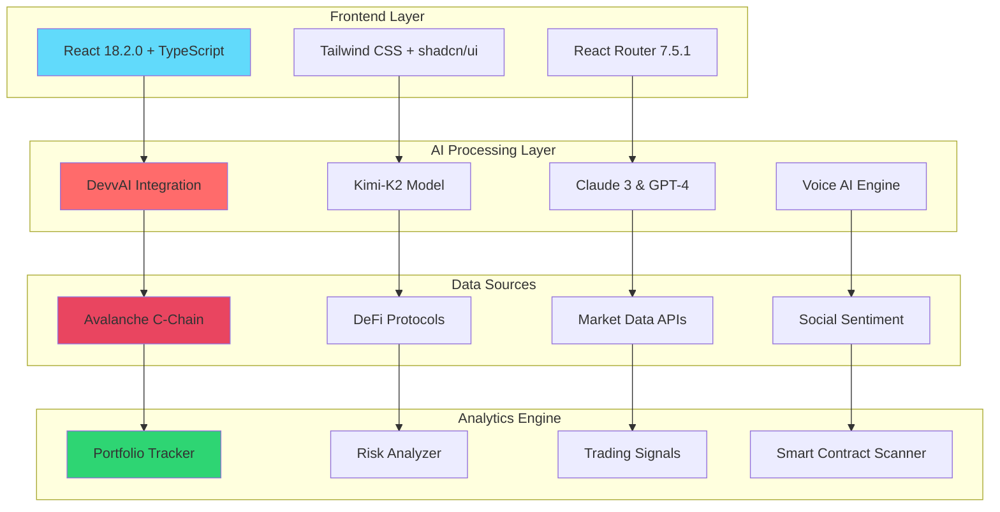
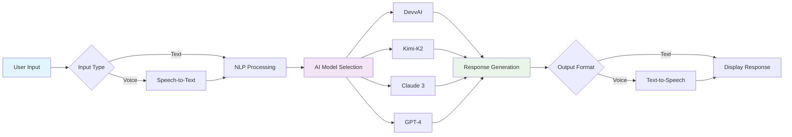
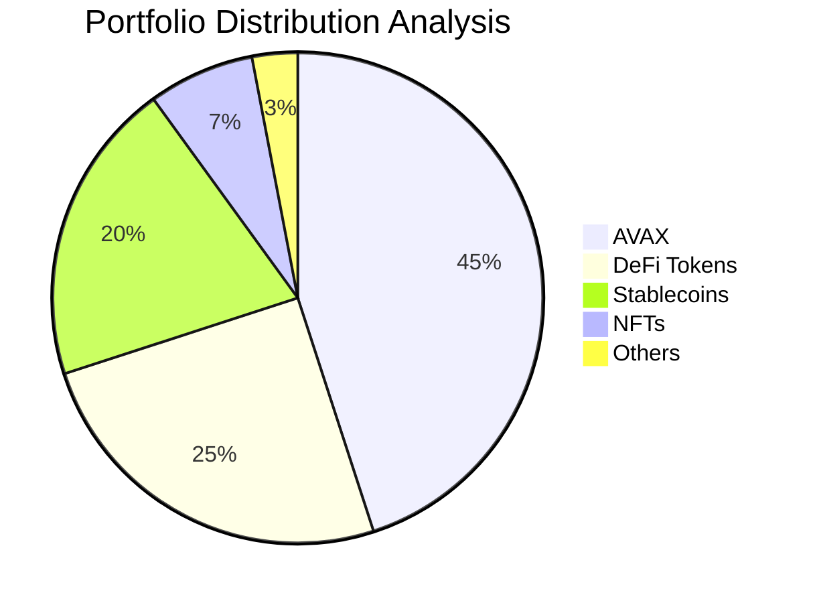
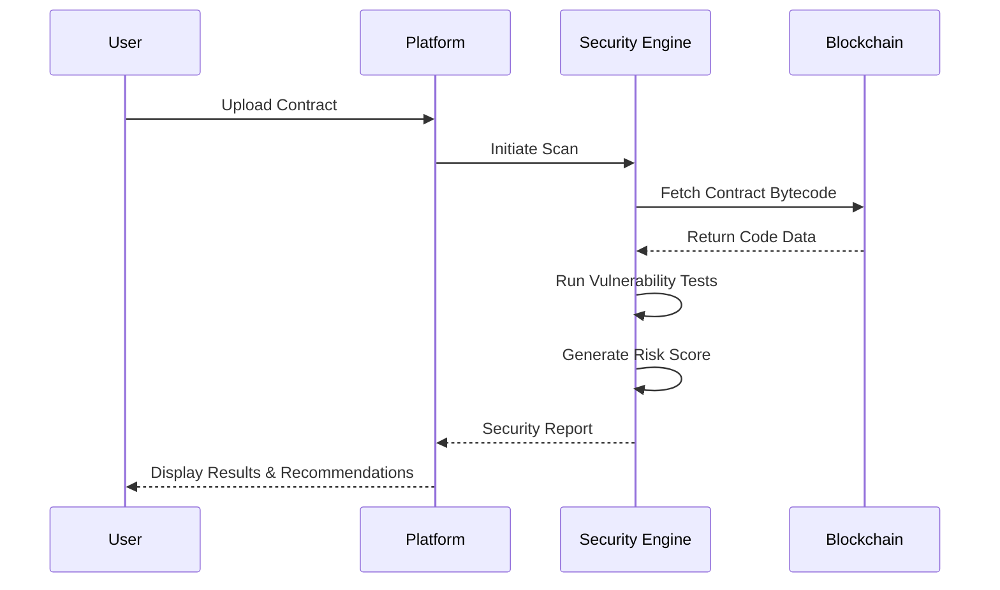
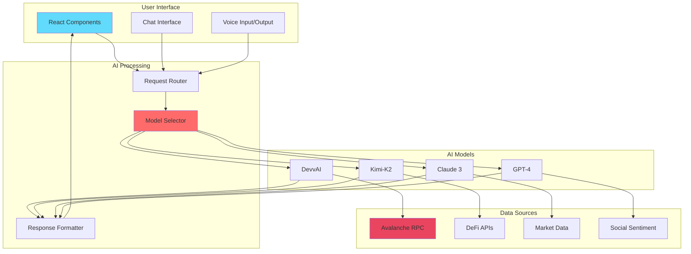
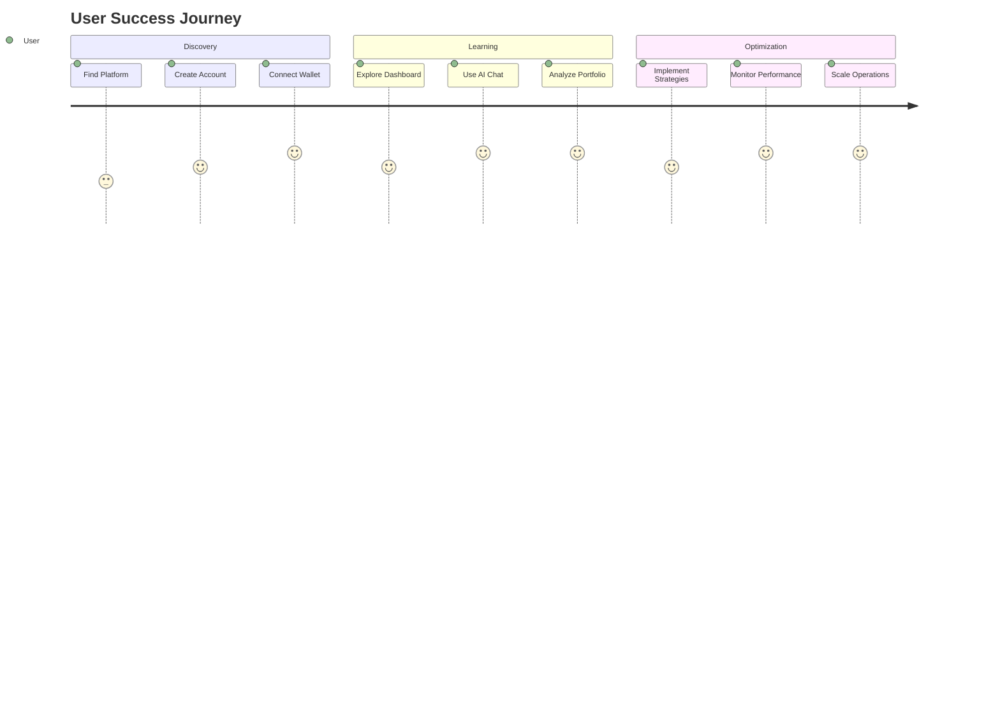
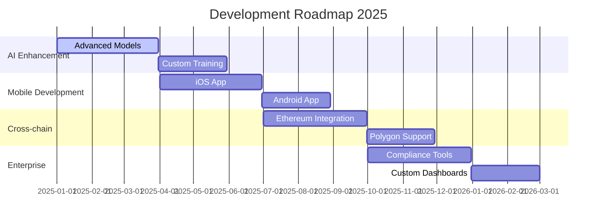

# 🏔️ Avalanche AI Analytics Platform

**Next-Generation Blockchain Intelligence & DeFi Analytics**  
*Powered by Advanced AI Technology*

[ | Built by [Yash Kavaiya](https://linkedin.com/in/yashkavaiya) - Gen AI Guru

***

## 📋 Table of Contents

- [🎯 Platform Overview](#-platform-overview)
- [✨ Key Features](#-key-features)
- [🤖 AI-Powered Capabilities](#-ai-powered-capabilities)
- [📊 Analytics Modules](#-analytics-modules)
- [🏗️ Technical Architecture](#️-technical-architecture)
- [🚀 Getting Started](#-getting-started)
- [💰 Pricing Plans](#-pricing-plans)
- [📈 ROI & Benefits](#-roi--benefits)
- [🛣️ Development Roadmap](#️-development-roadmap)
- [🔗 Links & Resources](#-links--resources)

***

## 🎯 Platform Overview

### What is Avalanche AI?

Avalanche AI is a **comprehensive blockchain analytics platform** that combines the power of artificial intelligence with real-time blockchain data to provide unprecedented insights into the Avalanche ecosystem. Our platform serves traders, institutions, and developers with enterprise-grade analytics and intelligence.

| Core Component | Description | Status |
|----------------|-------------|--------|
| **AI Core** | Advanced machine learning models for predictions | ✅ Active |
| **Analytics** | Real-time blockchain data processing | ✅ Active |
| **DeFi** | Multi-protocol DeFi monitoring and analysis | ✅ Active |
| **Security** | Smart contract vulnerability detection | ✅ Active |

### Platform Architecture



***

## ✨ Key Features

### Core Analytics Features

| Feature | Description | Benefit |
|---------|-------------|---------|
| 🧠 **Market Intelligence** | Real-time price tracking, sentiment analysis, and AI-powered trading signals | 35% better trading decisions |
| 💼 **Wallet Analytics** | Comprehensive portfolio tracking, risk assessment, and performance metrics | 80% time saved on analysis |
| 🛡️ **Security Scanner** | Automated smart contract auditing and vulnerability detection | 60% risk reduction |
| 💬 **AI Chat Interface** | Natural language processing for blockchain queries with voice capabilities | Instant insights |
| 📊 **DeFi Dashboard** | Multi-protocol yield tracking and opportunity identification | Maximize returns |
| 🔍 **NFT Analytics** | Collection analysis, rarity tracking, and portfolio valuation | Complete NFT insights |

### AI-Powered Chat Interface

Our advanced conversational AI supports multiple interaction modes:



***

## 📊 Analytics Modules

### DeFi Analytics Dashboard

Real-time monitoring of major Avalanche DeFi protocols:

| Protocol | TVL | APY | Risk Level | Features |
|----------|-----|-----|------------|----------|
| **Trader Joe** | $180M | 12.3% | 🟢 Low | AMM, Yield Farming |
| **Benqi** | $125M | 8.7% | 🟢 Low | Lending, Liquid Staking |
| **Pangolin** | $45M | 15.7% | 🟡 Medium | DEX, LP Rewards |
| **Yield Yak** | $32M | 18.3% | 🔴 High | Auto-compounding |

#### Key DeFi Metrics
- **Position Tracking**: Monitor investments across protocols
- **Yield Optimization**: Identify best farming opportunities  
- **Impermanent Loss**: Calculate and predict IL risks
- **APY Calculations**: Real-time yield computations

### Wallet Analysis Engine

#### Risk Assessment Matrix

| Risk Factor | Weight | Calculation Method |
|-------------|--------|-------------------|
| **Diversification Score** | 30% | Portfolio distribution analysis |
| **Security Vulnerabilities** | 25% | Smart contract interaction safety |
| **Transaction Patterns** | 20% | Behavioral analysis |
| **Protocol Risk Exposure** | 15% | DeFi protocol safety scores |
| **Market Correlation** | 10% | Asset correlation analysis |

#### Performance Metrics



### Smart Contract Security Analyzer

#### Security Scan Categories

| Vulnerability Type | Detection Rate | Impact Level |
|-------------------|----------------|--------------|
| **Reentrancy Attacks** | 99.2% | 🔴 Critical |
| **Integer Overflow/Underflow** | 98.7% | 🟡 Medium |
| **Access Control Issues** | 97.5% | 🔴 Critical |
| **Gas Optimization** | 95.8% | 🟢 Low |
| **Function Visibility** | 99.8% | 🟡 Medium |

#### Security Analysis Workflow



### NFT Analytics & Portfolio Tracking

#### Collection Analysis Features

| Metric | Data Source | Update Frequency |
|--------|-------------|------------------|
| **Floor Price** | Marketplace APIs | Real-time |
| **Volume Statistics** | Transaction data | 5 minutes |
| **Rarity Calculations** | Trait analysis | Daily |
| **Holder Distribution** | Blockchain data | Hourly |

#### Portfolio Valuation

- **Total NFT Value**: Real-time estimation based on floor prices
- **P&L Tracking**: Historical performance analysis
- **Rarity Score**: Advanced trait-based calculations
- **Market Alerts**: Price movement notifications

### Subnet Explorer & Validator Monitoring

#### Network Performance Dashboard

| Subnet | Validators | Uptime | Total Stake | Block Time |
|--------|-----------|---------|-------------|------------|
| **DeFi Kingdoms** | 12 | 99.8% | 2M AVAX | 2.1s |
| **Swimmer Network** | 8 | 99.7% | 1.5M AVAX | 2.3s |
| **Crabada** | 10 | 99.5% | 1.2M AVAX | 2.0s |

#### Validator Analytics
- **Performance Metrics**: Uptime, block production, rewards
- **Stake Distribution**: Delegation analysis and tracking
- **Network Health**: Real-time subnet monitoring

***

## 🏗️ Technical Architecture

### Technology Stack

| Layer | Technology | Version | Purpose |
|-------|------------|---------|---------|
| **Frontend** | React | 18.2.0 | User Interface |
| **Type Safety** | TypeScript | 5.7.2 | Code Quality |
| **Build Tool** | Vite | 6.3.1 | Development & Build |
| **Styling** | Tailwind CSS | 3.4.1 | Responsive Design |
| **Components** | shadcn/ui | Latest | UI Library |
| **Routing** | React Router | 7.5.1 | Navigation |

### AI Integration Architecture



***

## 🚀 Getting Started

### Prerequisites

- Node.js 18+ or Bun (recommended)
- Git
- Avalanche wallet (Core, MetaMask, etc.)

### Quick Installation

```bash
# Clone the repository
git clone https://github.com/Yash-Kavaiya/Avalanche-AI.git
cd Avalanche-AI

# Install dependencies (bun recommended for speed)
bun install
# or npm install

# Start development server  
bun dev
# or npm run dev
```

🌐 **Development Server**: http://localhost:5173  
🚀 **Live Demo**: [preview-exxgedhcwkjk.devv.app](https://preview-exxgedhcwkjk.devv.app)

### Production Deployment

```bash
# Build for production
bun run build

# Preview production build
bun preview
```

### Environment Configuration

Create a `.env.local` file:

```env
# Avalanche Network Configuration
VITE_AVALANCHE_RPC_URL=https://api.avax.network/ext/bc/C/rpc
VITE_AVALANCHE_NETWORK_ID=43114

# AI Service Configuration  
VITE_OPENAI_API_KEY=your_openai_key
VITE_CLAUDE_API_KEY=your_claude_key
VITE_DEVV_AI_KEY=your_devv_key

# Analytics Configuration
VITE_ANALYTICS_ENDPOINT=your_analytics_url
```

***

## 💰 Pricing Plans

### Plan Comparison

| Feature | Starter | Professional | Enterprise |
|---------|---------|--------------|------------|
| **AI Chat Queries** | 100/month | Unlimited | Unlimited |
| **Wallet Tracking** | 3 wallets | 10 wallets | Unlimited |
| **Real-time Data** | ✅ | ✅ | ✅ |
| **Historical Data** | 30 days | 1 year | Unlimited |
| **API Access** | ❌ | Limited | Full Access |
| **Portfolio Alerts** | Basic | Advanced | Custom |
| **Smart Contract Scanning** | 5/month | 50/month | Unlimited |
| **DeFi Analytics** | Basic | Advanced | Professional |
| **NFT Tracking** | 10 items | 100 items | Unlimited |
| **Support** | Email | Priority | Dedicated Manager |
| **Custom Reports** | ❌ | ✅ | ✅ |
| **Team Collaboration** | ❌ | 5 users | Unlimited |
| **White Label** | ❌ | ❌ | ✅ |
| **Monthly Price** | **Free** | **$49** | **Custom** |

### Enterprise Features

- **Custom AI Model Training**: Tailored algorithms for your use case
- **Dedicated Infrastructure**: Private cloud deployment
- **SLA Guarantees**: 99.9% uptime commitment
- **Compliance Support**: SOC2, GDPR, regulatory reporting
- **Integration Support**: Custom API development
- **Training & Onboarding**: Dedicated success manager

***

## 📈 ROI & Benefits

### Proven Results

#### For Individual Traders
| Metric | Improvement | Time Period |
|--------|-------------|-------------|
| **Trading Decision Quality** | +35% | First 30 days |
| **Analysis Time Saved** | 80% | Daily operations |
| **Risk Reduction** | 60% | Portfolio management |
| **Yield Optimization** | +25% | DeFi strategies |

#### For Institutions  
| Benefit | Impact | Measurement |
|---------|--------|-------------|
| **Professional Analytics** | Enhanced decision making | Quantified risk metrics |
| **Team Collaboration** | Improved efficiency | 40% faster reporting |
| **Compliance Reporting** | Automated compliance | 90% manual work reduction |
| **Risk Management** | Better oversight | Real-time monitoring |

> **Average ROI: 250% in the first year**

### Success Stories



***

## 🛣️ Development Roadmap

### 2025 Development Timeline

| Quarter | Focus Area | Key Features | Status |
|---------|------------|--------------|--------|
| **Q1 2025** | **Advanced AI Models** | -  Enhanced prediction accuracy<br>-  Custom model training<br>-  Multi-language support | 🚧 In Progress |
| **Q2 2025** | **Mobile App Launch** | -  iOS & Android apps<br>-  Push notifications<br>-  Offline analytics | 📋 Planned |
| **Q3 2025** | **Cross-chain Support** | -  Ethereum integration<br>-  Polygon support<br>-  Cross-chain arbitrage | 📋 Planned |
| **Q4 2025** | **Enterprise Features** | -  Advanced compliance tools<br>-  Custom dashboards<br>-  Enterprise API | 📋 Planned |

### Feature Development Pipeline



### Long-term Vision (2026+)

- **AI Governance**: Decentralized AI model governance
- **Layer 0 Integration**: Subnet-specific analytics
- **Institutional Trading**: Automated trading strategies
- **Global Expansion**: Multi-region deployment
- **Open Source Components**: Community-driven development

***

## 🔗 Links & Resources

### Official Links

| Platform | URL | Description |
|----------|-----|-------------|
| 🌐 **Live Application** | [easy-ai-labs.lovable.app](https://easy-ai-labs.lovable.app) | Main platform |
| 📱 **Demo Preview** | [preview-exxgedhcwkjk.devv.app](https://preview-exxgedhcwkjk.devv.app) | Live demo |
| 💼 **LinkedIn Company** | [linkedin.com/company/genai-guru](https://linkedin.com/company/genai-guru) | Company updates |
| 👨‍💻 **Creator Profile** | [linkedin.com/in/yashkavaiya](https://linkedin.com/in/yashkavaiya) | Yash Kavaiya |
| 🐦 **Twitter** | [@genai-guru](https://twitter.com/genai-guru) | Latest updates |
| 📺 **YouTube Channel** | [@genai-guru](https://youtube.com/@genai-guru) | Tutorials & updates |

### Developer Resources

- **API Documentation**: [Coming Soon]
- **SDK Downloads**: [Coming Soon]  
- **Developer Discord**: [Join Community]
- **GitHub Repository**: [Avalanche-AI](https://github.com/Yash-Kavaiya/Avalanche-AI)
- **Bug Reports**: [GitHub Issues](https://github.com/Yash-Kavaiya/Avalanche-AI/issues)

### Educational Content

- **User Guides**: Step-by-step tutorials
- **Video Tutorials**: YouTube channel content
- **Webinar Series**: Monthly deep-dives
- **Blog Posts**: Technical insights and updates
- **Case Studies**: Real-world implementation examples

***

## 🤝 Contributing

We welcome contributions from the community! Here's how you can help:

### Contribution Guidelines

1. **Fork** the repository
2. **Create** your feature branch (`git checkout -b feature/AmazingFeature`)
3. **Commit** your changes (`git commit -m 'Add some AmazingFeature'`)
4. **Push** to the branch (`git push origin feature/AmazingFeature`)
5. **Open** a Pull Request

### Development Areas

- **AI Model Enhancement**: Improve prediction accuracy
- **UI/UX Design**: Enhance user experience
- **Security Auditing**: Smart contract analysis
- **Documentation**: Improve guides and tutorials
- **Testing**: Expand test coverage
- **Performance**: Optimize processing speed

***

## 📄 License

This project is licensed under the **MIT License** - see the [LICENSE](LICENSE) file for details.

***

## 🙏 Acknowledgments

- **Avalanche Team**: For the robust blockchain infrastructure
- **AI Model Providers**: OpenAI, Anthropic, and DevvAI
- **Open Source Community**: For the amazing tools and libraries
- **Beta Testers**: For valuable feedback and testing

***

## ⭐ Support the Project

If you find Avalanche AI valuable:

- ⭐ **Star this repository** on GitHub
- 🔄 **Share** with your network
- 🐛 **Report bugs** and suggest features
- 💡 **Contribute** to the codebase
- 📺 **Subscribe** to our YouTube channel

---

<div align="center">

**Built with ❤️ by [Easy AI Labs](https://easy-ai-labs.lovable.app)**

*Powered by Avalanche Blockchain & Advanced AI Technology*

**Follow us for updates:** [LinkedIn](https://linkedin.com/company/genai-guru) | [Twitter](https://twitter.com/genai-guru) | [YouTube](https://youtube.com/@genai-guru)


</div>

[1](https://ppl-ai-file-upload.s3.amazonaws.com/web/direct-files/attachments/10242390/c5d7b8fe-1ab8-4905-a2b1-02c18adb4e4c/AI_Agents_Ava.pdf)
